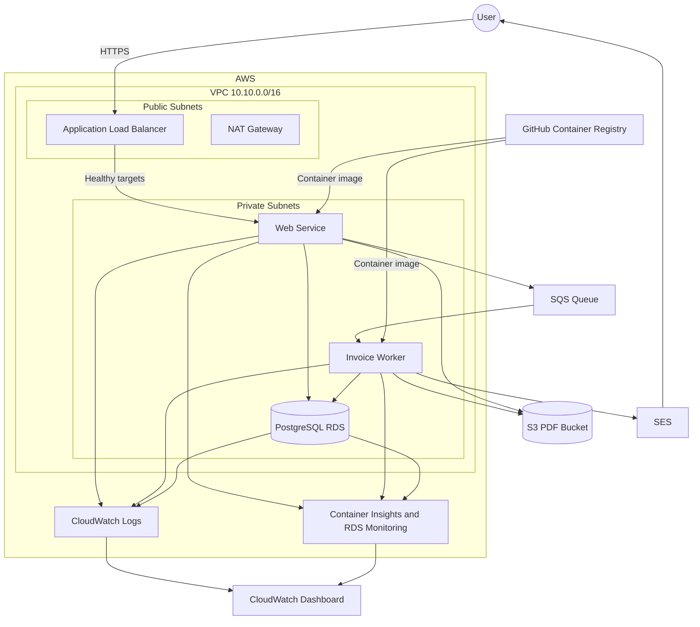

# Muyu Infrastructure

Terraform configuration for a beginner-focused AWS deployment of the Muyu invoice service.

## Architecture

The web application runs on ECS Fargate behind a public load balancer and queues invoices for a private Fargate worker. The worker generates PDFs, stores them in S3, and emails them through SES.



Route 53 serves the participant subdomain and points it to the Application Load Balancer. ACM provides the TLS certificate. The load balancer redirects HTTP requests to HTTPS.

## Network

| Resource | Configuration |
|---|---|
| Region | `us-east-1` |
| VPC | `10.10.0.0/16` |
| Public subnet 1 | `10.10.10.0/24` in `us-east-1a` |
| Public subnet 2 | `10.10.11.0/24` in `us-east-1b` |
| Private subnet 1 | `10.10.20.0/24` in `us-east-1a` |
| Private subnet 2 | `10.10.21.0/24` in `us-east-1b` |

The public subnets route through the Internet Gateway. The private subnets share one NAT Gateway for outbound internet access.

The RDS security group accepts PostgreSQL traffic only from the web and worker security groups. Only the web service accepts application traffic from the load balancer; the worker has no inbound rule.

## Application

The number of web tasks is configured with `invoice_desired_count`; the workshop runs one worker task. The load balancer checks `GET /health`, and the ECS deployment circuit breaker automatically rolls back failed deployments.

The web process saves an invoice, sends its ID to SQS, and returns HTTP `202`. The worker generates the PDF, stores it under `invoices/` in the private S3 bucket, emails it through SES, and marks the invoice complete.

The load balancer appends the original client address to the `X-Forwarded-For` header.

## Container Registry

Both ECS services pull `ghcr.io/aws-user-group-la-paz/muyu-invoice-generator` using the configured `image_tag`.

## Database

The deployment creates a private PostgreSQL 15 RDS instance with:

- Enhanced Monitoring every 60 seconds
- CloudWatch Database Insights Standard mode
- PostgreSQL and upgrade logs exported to CloudWatch
- Three-day CloudWatch log retention

This is a cost-focused teaching database. Multi-AZ and final snapshots are intentionally disabled.

## Email

Terraform registers the address configured by `email_from` as an SES identity. Confirm its verification email after the identity is created.

The worker emails PDFs as attachments and requires `ses:SendRawEmail`.

While the account remains in the SES sandbox, sender and recipient identities must be verified. If the same address is used for sending and receiving, it only needs to be verified once in `us-east-1`.

## Observability

The CloudWatch dashboard has separate sections for incoming requests, the ECS web application, the invoice queue, the ECS worker, and PostgreSQL. Each service section includes its own metrics and logs. ECS Container Insights uses enhanced observability.

Each ECS task also runs an OpenTelemetry Collector sidecar. The application sends OTLP/HTTP logs and traces to the task-local collector at `127.0.0.1:4318`; the collector batches and retries delivery to Grafana Cloud. Add `grafana_otlp_endpoint` and `grafana_otlp_username` to `terraform.tfvars`.

The bootstrap step creates the `/\<name-prefix\>/grafana/otlp/token` SSM SecureString with a placeholder. Replace it with the Grafana write token before deploying the infrastructure so the collectors start with valid credentials.

## Requirements

Tool versions are managed by [mise](https://mise.jdx.dev/). AWS credentials must be available through the AWS CLI environment.

```sh
mise install
aws sts get-caller-identity
```

## Configuration

Update `terraform.tfvars` before deploying:

```hcl
domain                = "yamil.muyuinvoices.click"
name_prefix           = "student-muyu"
db_password           = "replace-with-a-password"
image_tag             = "v2026.07.02-r55.1"
invoice_desired_count = 1
email_from             = "verified-sender@example.com"
grafana_otlp_endpoint = "<grafana-otlp-endpoint>"
grafana_otlp_username = "<grafana-instance-id>"
```

Use a prefix containing lowercase letters, numbers, and hyphens. Do not use the literal `<your-name>` placeholder because AWS resource names do not accept angle brackets.

The password is intentionally supplied directly for this beginner exercise. Production deployments should use AWS Secrets Manager rather than storing credentials in Terraform variables or ECS task definitions.

## Staged Deployment

Only resources requiring external verification are deployed separately. Terraform handles the remaining dependency order during the final untargeted apply.

### 1. Bootstrap external requirements

```sh
terraform init

terraform apply \
  -target=aws_route53_zone.domain \
  -target=aws_sesv2_email_identity.invoice_sender \
  -target=aws_ssm_parameter.grafana_otlp_token

terraform output -json name_servers
```

Provide the displayed nameservers to the administrator of `muyuinvoices.click`, confirm the SES verification email, and wait until the DNS delegation is visible:

```sh
dig NS yamil.muyuinvoices.click +short
```

Replace the Grafana token placeholder:

```sh
aws ssm put-parameter \
  --name "/student-muyu/grafana/otlp/token" \
  --type SecureString \
  --value "<grafana-write-token>" \
  --overwrite
```

Do not continue until DNS delegation and SES verification are complete and the Grafana token has been replaced.

### 2. Deploy the infrastructure

The untargeted apply creates the certificate and its validation record, waits for ACM validation, and then creates the network, database, load balancer, DNS alias, queues, storage, IAM permissions, and ECS services in dependency order.

```sh
mise run check
mise run plan
terraform show tfplan.binary
mise run scan
export INFRACOST_API_KEY="<your-api-key>"
mise run cost
terraform apply tfplan.binary
```

### 3. Verify operational readiness

Confirm HTTP redirects to the HTTPS subdomain:

```sh
terraform output -raw alb_dns_name
curl --head http://yamil.muyuinvoices.click
curl --head https://yamil.muyuinvoices.click
```

Submit a new invoice and verify:

1. The web request returns HTTP `202`.
2. Web logs contain `invoice_queued`.
3. The SQS queue briefly shows the invoice waiting or processing.
4. Worker logs contain `invoice_completed`.
5. The recipient receives the attached PDF.
6. Invoice history shows `Complete`.
7. The stored PDF downloads successfully.

A failed invoice is terminal and its queue message is deleted. Submit a new invoice after correcting a failed deployment or permission.

### 4. Destroy the workshop environment

```sh
terraform destroy
```

Plan files can contain sensitive values and are excluded from Git.
