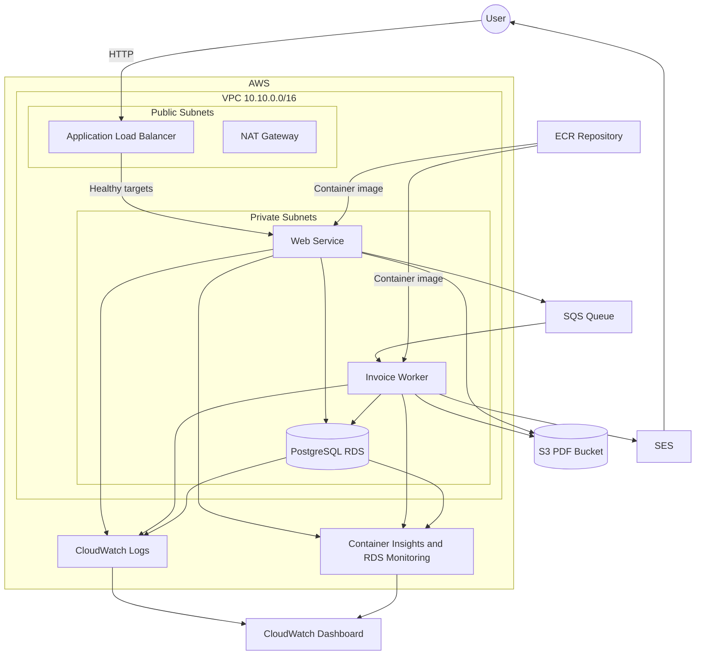

# Muyu Infrastructure

Terraform configuration for a beginner-focused AWS deployment of the Muyu invoice service.

## Architecture

The web application runs on ECS Fargate behind a public load balancer and queues invoices for a private Fargate worker. The worker generates PDFs, stores them in S3, and emails them through SES.



## Network

| Resource | Configuration |
|---|---|
| Region | `us-east-1` |
| VPC | `10.10.0.0/16` |
| Public subnet 1 | `10.10.10.0/24` in `us-east-1a` |
| Public subnet 2 | `10.10.11.0/24` in `us-east-1b` |
| Private subnet 1 | `10.10.20.0/24` in `us-east-1a` |
| Private subnet 2 | `10.10.21.0/24` in `us-east-1b` |

The public subnets route through the Internet Gateway. The private subnets share one NAT Gateway for outbound internet access.

The RDS security group accepts PostgreSQL traffic only from the web and worker security groups. Only the web service accepts application traffic from the load balancer; the worker has no inbound rule.

## Application

The number of web tasks is configured with `invoice_desired_count`; the workshop runs one worker task. The load balancer checks `GET /health`, and the ECS deployment circuit breaker automatically rolls back failed deployments.

The web process saves an invoice, sends its ID to SQS, and returns HTTP `202`. The worker generates the PDF, stores it under `invoices/` in the private S3 bucket, emails it through SES, and marks the invoice complete.

The load balancer appends the original client address to the `X-Forwarded-For` header.

## Container Registry

The ECR repository uses immutable image tags and disables scan-on-push for this teaching deployment.

Its lifecycle policy:

- Deletes untagged images after one day
- Retains the ten newest tagged images
- Deletes remaining images when the Terraform deployment is destroyed

## Database

The deployment creates a private PostgreSQL 15 RDS instance with:

- Enhanced Monitoring every 60 seconds
- CloudWatch Database Insights Standard mode
- PostgreSQL and upgrade logs exported to CloudWatch
- Three-day CloudWatch log retention

This is a cost-focused teaching database. Multi-AZ and final snapshots are intentionally disabled.

## Email

Terraform registers the address configured by `email_from` as an SES identity. Confirm its verification email after the identity is created.

The worker emails PDFs as attachments and requires `ses:SendRawEmail`.

While the account remains in the SES sandbox, sender and recipient identities must be verified. If the same address is used for sending and receiving, it only needs to be verified once in `us-east-1`.

## Observability

The CloudWatch dashboard has separate sections for incoming requests, the ECS web application, the invoice queue, the ECS worker, and PostgreSQL. Each service section includes its own metrics and logs. ECS Container Insights uses enhanced observability.

## Requirements

Tool versions are managed by [mise](https://mise.jdx.dev/). AWS credentials must be available through the AWS CLI environment.

```sh
mise install
aws sts get-caller-identity
```

## Configuration

Update `terraform.tfvars` before deploying:

```hcl
name_prefix           = "student-muyu"
db_password           = "replace-with-a-password"
image_tag             = "v2026.07.02-r55.1"
invoice_desired_count = 1
email_from             = "verified-sender@example.com"
```

Use a prefix containing lowercase letters, numbers, and hyphens. Do not use the literal `<your-name>` placeholder because AWS resource names do not accept angle brackets.

The password is intentionally supplied directly for this beginner exercise. Production deployments should use AWS Secrets Manager rather than storing credentials in Terraform variables or ECS task definitions.

## Staged Deployment

The workshop uses targeted Terraform applies so participants can inspect each infrastructure layer before introducing the next one.

Terraform warns that targeted applies can omit unrelated resources. This is intentional during the workshop; the final stage always runs an untargeted plan.

### 1. Bootstrap ECR and SES

```sh
terraform init

terraform apply \
  -target=aws_ecr_repository.main \
  -target=aws_sesv2_email_identity.invoice_sender
```

Confirm the SES verification email.

Build and push the application image:

```sh
ECR_REPO="$(terraform output -raw ecr_repo_url)"

aws ecr get-login-password --region us-east-1 \
  | docker login \
      --username AWS \
      --password-stdin "$ECR_REPO"

docker build \
  --tag "$ECR_REPO:<image-tag>" \
  ../muyu-invoice-generator

docker push "$ECR_REPO:<image-tag>"
```

Replace `<image-tag>` with the `image_tag` value from `terraform.tfvars`.

### 2. Deploy the network

```sh
terraform apply \
  -target=aws_route.public_internet \
  -target=aws_route.private_nat \
  -target=aws_route_table_association.public1 \
  -target=aws_route_table_association.public2 \
  -target=aws_route_table_association.private1 \
  -target=aws_route_table_association.private2
```

Inspect the VPC, public and private subnets, gateways, and route tables.

### 3. Deploy the platform and database

```sh
terraform apply \
  -target=module.cluster \
  -target=aws_ecr_lifecycle_policy.main \
  -target=aws_db_instance.main
```

Inspect the ECS cluster, load balancer, RDS instance, security groups, and database logs. Terraform may create ECS security groups during this stage because RDS references them.

### 4. Deploy the queue and PDF storage

```sh
terraform apply \
  -target=aws_sqs_queue.invoice_pdf_jobs \
  -target=aws_s3_bucket_public_access_block.invoice_pdfs
```

Inspect the encrypted SQS queue and private S3 bucket. The public-access-block target includes its bucket dependency.

### 5. Deploy IAM permissions

Create the task roles and attach their application permissions before starting the services:

```sh
terraform apply \
  -target=aws_iam_role_policy.invoice_web \
  -target=aws_iam_role_policy.invoice_worker
```

Terraform creates the web and worker task roles as dependencies of these policies. Inspect the web permissions for SQS and S3, and the worker permissions for SQS, S3, and `ses:SendRawEmail`.

### 6. Deploy the web and worker services

```sh
terraform apply \
  -target=module.invoice_service \
  -target=module.invoice_worker
```

Inspect the separate ECS services, task definitions, security groups, and CloudWatch log groups.

### 7. Run the complete plan

Run the untargeted validation, security scan, cost estimate, and final apply:

```sh
mise run check
mise run plan
terraform show tfplan.binary
mise run scan
export INFRACOST_API_KEY="<your-api-key>"
mise run cost
terraform apply tfplan.binary
```

For this three-hour workshop:

```text
estimated workshop baseline = total hourly cost × 3
```

### 8. Verify operational readiness

Submit a new invoice and verify:

1. The web request returns HTTP `202`.
2. Web logs contain `invoice_queued`.
3. The SQS queue briefly shows the invoice waiting or processing.
4. Worker logs contain `invoice_completed`.
5. The recipient receives the attached PDF.
6. Invoice history shows `Complete`.
7. The stored PDF downloads successfully.

A failed invoice is terminal and its queue message is deleted. Submit a new invoice after correcting a failed deployment or permission.

### 9. Destroy the workshop environment

```sh
terraform destroy
```

Plan files can contain sensitive values and are excluded from Git.
