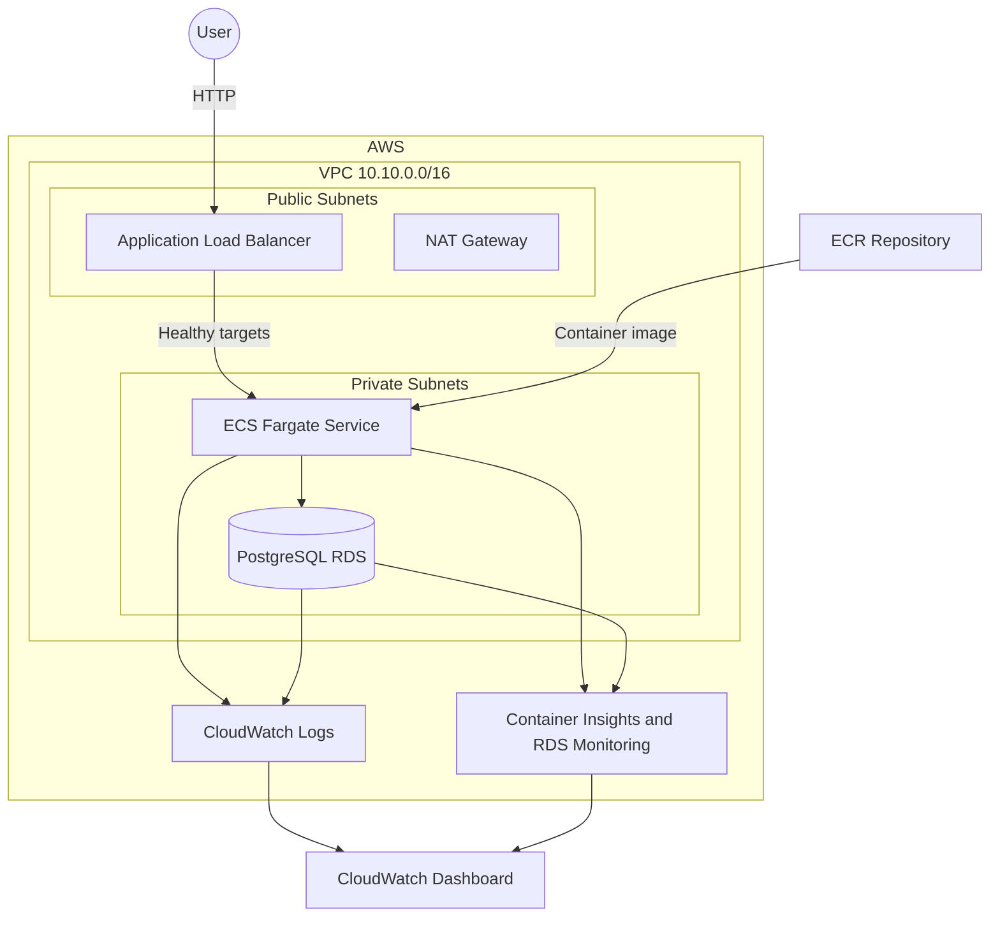

# Muyu Infrastructure

Terraform configuration for a beginner-focused AWS deployment of the Muyu invoice service.

## Architecture

The application runs on ECS Fargate behind a public load balancer, connects to a private PostgreSQL database, and reports logs and metrics to CloudWatch.



## Network

| Resource | Configuration |
|---|---|
| Region | `us-east-1` |
| VPC | `10.10.0.0/16` |
| Public subnet 1 | `10.10.10.0/24` in `us-east-1a` |
| Public subnet 2 | `10.10.11.0/24` in `us-east-1b` |
| Private subnet 1 | `10.10.20.0/24` in `us-east-1a` |
| Private subnet 2 | `10.10.21.0/24` in `us-east-1b` |

The public subnets route through the Internet Gateway. The private subnets share one NAT Gateway for outbound internet access.

The RDS security group accepts PostgreSQL traffic only from the ECS service security group. The ECS service accepts application traffic only from the load balancer security group.

## Application

The number of Fargate tasks is configured with `invoice_desired_count`. The load balancer checks `GET /health`, and the ECS deployment circuit breaker automatically rolls back failed deployments.

The load balancer appends the original client address to the `X-Forwarded-For` header.

## Container Registry

The ECR repository uses immutable image tags and disables scan-on-push for this teaching deployment.

Its lifecycle policy:

- Deletes untagged images after one day
- Retains the ten newest tagged images
- Deletes remaining images when the Terraform deployment is destroyed

Push the image tag configured by `image_tag` before deploying the ECS service.

## Database

The deployment creates a private PostgreSQL 15 RDS instance with:

- Enhanced Monitoring every 60 seconds
- CloudWatch Database Insights Standard mode
- PostgreSQL and upgrade logs exported to CloudWatch
- Three-day CloudWatch log retention

This is a cost-focused teaching database. Multi-AZ and final snapshots are intentionally disabled.

## Observability

The CloudWatch dashboard has separate sections for incoming requests, ECS, RDS, application logs, and PostgreSQL logs. ECS Container Insights uses enhanced observability.

## Requirements

Tool versions are managed by [mise](https://mise.jdx.dev/). AWS credentials must be available through the AWS CLI environment.

```sh
mise install
aws sts get-caller-identity
```

## Configuration

Update `terraform.tfvars` before deploying:

```hcl
name_prefix           = "student-muyu"
db_password           = "replace-with-a-password"
image_tag             = "v2026.07.02-r55.1"
invoice_desired_count = 1
```

Use a prefix containing lowercase letters, numbers, and hyphens. Do not use the literal `<your-name>` placeholder because AWS resource names do not accept angle brackets.

The password is intentionally supplied directly for this beginner exercise. Production deployments should use AWS Secrets Manager rather than storing credentials in Terraform variables or ECS task definitions.

## Terraform Workflow

```sh
terraform init                 # Initialize the working directory
mise run check                 # Check formatting and configuration
mise run plan                  # Create tfplan.binary and tfplan.json
terraform show tfplan.binary   # Review the saved plan
terraform apply tfplan.binary  # Apply the reviewed plan
terraform output               # Display the deployed endpoints
terraform destroy              # Destroy the teaching deployment
```

Plan files can contain sensitive values and are excluded from Git.

## Security Scan

```sh
checkov -f tfplan.json
```

## Cost Estimate

```sh
export INFRACOST_API_KEY="<your-api-key>"
infracost breakdown --path tfplan.json
```
