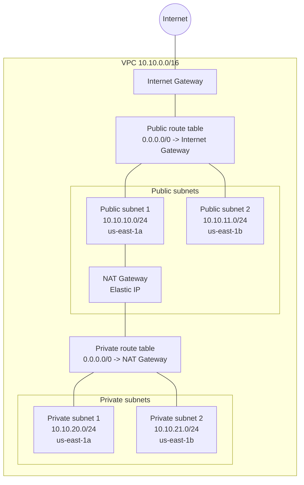

# muyu-infrastructure

This repository contains infrastructure code for the Muyu application.

AWS resources for Muyu are managed with Terraform. This repository creates the
network foundation shown below.

## Network Architecture

The network layout is:

- Region: `us-east-1`
- VPC: `10.10.0.0/16`
- Public subnet 1: `10.10.10.0/24` in `us-east-1a`
- Public subnet 2: `10.10.11.0/24` in `us-east-1b`
- Private subnet 1: `10.10.20.0/24` in `us-east-1a`
- Private subnet 2: `10.10.21.0/24` in `us-east-1b`
- Internet Gateway for public subnet internet access
- NAT Gateway in public subnet 1 for private subnet outbound internet access
- One route table for public subnets
- One route table for private subnets



## Terraform Workflow

```sh
terraform init
terraform fmt
terraform validate
terraform plan
terraform apply
terraform destroy
```
